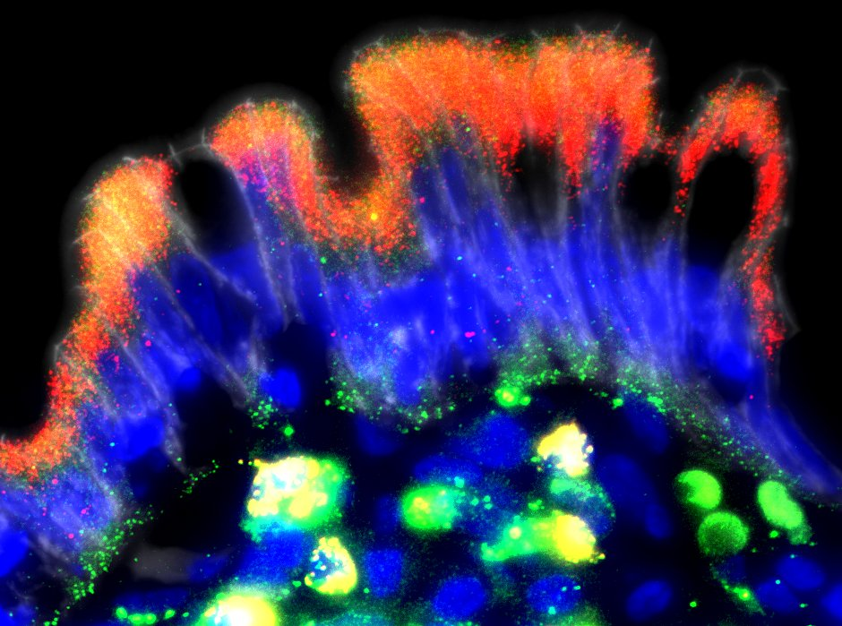

# Apicome

Code repository for: *link*

## LCM

* mouse_lcm - analysis of mouse LCM results
* human_lcm - analysis of human LCM results
* comparisons:
  * human_mouse - comparison between human and mouse LCM results
  * Moor - comparison between mouse LCM and data from Moor et al.

