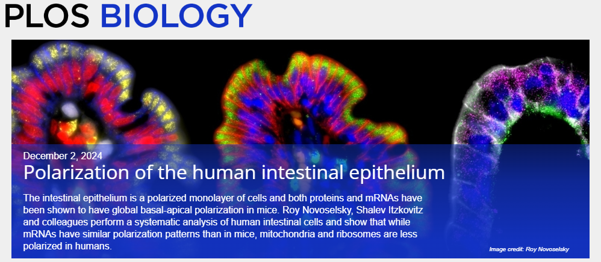

# Intra-cellular polarization of RNAs and proteins in the human small intestinal epithelium
This code is associated with the following manuscript: *link*.

The code is used to process the raw data and make all figures from the article.

## Folders
*run in order 
1. **mouse_rna** - analysis of mouse LCM RNA-seq
2. **human_rna** - analysis of human LCM RNA-seq
3. **human_proteomics**  
   3.1. **preprocess** - combine raw proteomics data into a CSV  
   3.2. **main** - analysis of human LCM mass-spectrometry proteomics 
4. **comparisons**  
   4.1. **human_mouse_rna** - comparison between human and mouse RNA-seq  
   4.2. **human_proteomics_rna** - comparison between human RNA-seq and proteomics  
   4.3. **Moor** - comparison between mouse RNA-seq and data from Moor et al. (2017)  
   4.4. **Bjorn** - correlation with Björn et al. (2011) and Harnik et al. (2021)  
   4.5. **McConnell** - comparison between human proteomics and data from McConnell R.E et al. (2011)

5. **image_analysis**  
   5.1. Measure of apical/basal compartments in human and mouse  
   5.2. smFISH quantification (genes) - quantification of dot intensity  
   5.3. smFISH quantification (ribosome & mitochondria) - quantification of intensity

